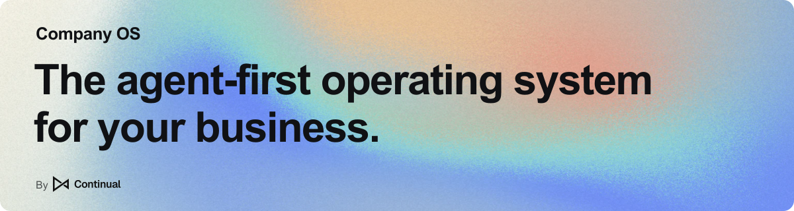

<h1 align="center">
  
</h1>

<p align="center">
  <strong>Unify your data and operations in software tailored to your business.</strong><br />
  Give agents the context and actions to help run it.
</p>

<p align="center">
  <a href="https://app.continual.ai/sign-up"><strong>Try on Continual ↗</strong></a> ·
  <a href="#quick-start">Run locally</a> ·
  <a href="#the-company-model">Explore the model</a> ·
  <a href="#make-it-yours">Customize</a>
</p>

<p align="center"><sub>Early preview · Apache 2.0</sub></p>


## Business software for the age of agents

Agents are changing how companies work—and how their software gets built.

Company OS models your business in software agents can **understand and operate**. Connect
your records, relationships, and rules in one system you own—and shape it around how your
company works.

- **Fit the way you work.** Tailor records, workflows, and screens to your process.
- **Connect the whole process.** Link customers, projects, and related work so agents can follow the context.
- **Put agents to work.** Give agents one API to read records and take action under your business rules.
- **Change as you grow.** Work with a coding agent to adapt the software when your process changes.

The vision is a **self-driving company**: people set direction, agents carry out the work,
and the software evolves with the business.

## Quick start

**[Try Company OS on Continual →](https://app.continual.ai/sign-up)**
Build and customize with agents, then deploy and run on Continual's managed platform.

**Run locally.** No Continual account required. You need **Node.js 24.14+ (or 25.4+), pnpm 11,
and PostgreSQL 18+**, running with a local role that can create databases.

Use a fresh local database: **`db:reset` replaces existing data in the configured database.**

```sh
git clone https://github.com/continual-ai/company-os.git
cd company-os
pnpm install --frozen-lockfile
pnpm db:reset
pnpm db:seed --scenario demo
pnpm dev
```

Open **[localhost:3002](http://localhost:3002)** and try **Support → Tickets**.
Local development signs you in automatically.

<details>
<summary>Database configuration and production setup</summary>

The default database is `postgresql://localhost:5432/company_os`. Put overrides in an ignored
`.env.local`; see [`.env.example`](apps/company-os/.env.example).

The seed command adds demo records; skip it to start without sample data.
For retained data, migrations, and production identity, follow the
[deployment guide](docs/deployment.md).

</details>

## Make it yours

Start with one process and shape the software around it. Edit the source directly or work
with a coding agent using the included
[onboard](.agents/skills/onboard/SKILL.md) and [customize](.agents/skills/customize/SKILL.md) skills.

For a fresh setup:

> Use $onboard to set this up for our company. Start with customer onboarding: customers,
> milestones, owners, blockers, and launch dates.

To adapt the included app:

> Use $customize to add response deadlines to support tickets based on priority. Show overdue
> tickets in a saved view and put the deadline on each ticket's page.

<details>
<summary><strong>Explore the included starting points</strong></summary>

Use the included modules as starting points, or build your own. They share one Company Model.

| Module          | Starting points                                       |
| --------------- | ----------------------------------------------------- |
| **Sales**       | Companies, contacts, leads, deals, and activities     |
| **Support**     | Tickets, customer replies, and engineering handoffs   |
| **Engineering** | Projects, issues, repositories, and pull requests     |
| **Hiring**      | Job postings, candidates, and applications            |
| **Marketing**   | Campaigns, content, enrollments, and outreach         |
| **Notes**       | Shared context attached to records across the company |

Enable modules in **Settings → Platform → Modules**.
Disabling a module hides its operations and screens while keeping its data.

</details>

## Put your agents to work

Connect a compatible agent through **[Developer Center → MCP](http://localhost:3002/developer/mcp)**
in your running app. With the demo data and the support and engineering modules enabled, try:

> Find Northstar Robotics' open support tickets. Check the linked engineering issues and
> customer replies, then add a note summarizing what is blocking each ticket.

Results appear as notes on the tickets in your app.

For a business action, ask it to **escalate an open ticket to engineering**. The included Action
creates and links an issue; retrying it returns the original issue.

<details>
<summary>MCP connection and execution</summary>

Use an **MCP client with Streamable HTTP support** and credentials accepted by your deployment.
The endpoint is `/api/mcp`.

Company OS checks project access, validates inputs, and applies business rules and attribution.
Your chosen agent runtime handles reasoning, scheduling, and execution.

</details>

## The Company Model

The Company Model is an executable description of your business: **what it works with, how
it connects, and what can happen**. Its definitions drive storage, validation, search, standard
pages, and the API.

| Concept        | What it describes                               | Example                                             |
| -------------- | ----------------------------------------------- | --------------------------------------------------- |
| **Objects**    | Records with typed properties and constraints   | A ticket's subject, priority, and status            |
| **Links**      | Relationships you can follow in both directions | A ticket's company; a company's tickets             |
| **Interfaces** | Contracts shared by different Object types      | Customers and tickets can both have notes           |
| **Queries**    | Read records or calculate results               | Summarize the pipeline by stage and currency        |
| **Actions**    | Change records or perform work                  | Escalate a ticket without creating duplicate issues |

Extend the model, and its generated pages and APIs follow.

<details>
<summary><strong>See the model behind the app</strong></summary>


Explore your running app in **[Developer Center → Model](http://localhost:3002/developer/model)**.

</details>

### Define your business in TypeScript

Use `defineObject`, `defineLink`, and `defineInterface` to describe your model. Objects come
with standard Queries (`get`, `list`, `batchGet`) and Actions (`create`, `update`, `delete`,
`batchDelete`). Declare custom operations in an Object's `queries` and `actions` fields.
Disable a standard Action by setting it to `false`, as the
[Escalation object](apps/company-os/src/modules/support-engineering/model/index.ts) does for direct writes.

<details>
<summary><strong>Example: a note that can attach to different kinds of records</strong></summary>

This is the core of the included [Notes module](apps/company-os/src/modules/notes/model/index.ts).

```ts
import {
  defineInterface,
  defineLink,
  defineObject,
  schema,
} from "#/runtime/model/index.ts"

const NoteSubject = defineInterface({
  id: "noteSubject",
  name: "Note subject",
  pluralName: "Note subjects",
  description: "A business record that can have notes attached.",
})

const Note = defineObject({
  id: "note",
  collection: "notes",
  name: "Note",
  pluralName: "Notes",
  description: "Notes on conversations, decisions, or next steps.",
  properties: {
    content: schema.markdown({
      label: "Content",
      minLength: 1,
      maxLength: 10_000,
    }),
  },
  search: { fields: ["content"] },
  display: { icon: "note", title: "content" },
})

const NoteSubjects = defineLink({
  id: "noteSubjects",
  name: "Note subjects",
  from: Note,
  to: NoteSubject,
  forward: { key: "subjects", label: "Subjects" },
  reverse: { key: "notes", label: "Notes" },
})
```

Objects opt in with `implements: [{ interface: NoteSubject }]`. The same note can then link to a
customer, ticket, or project. Both directions use one stored relationship.

Register these definitions with `defineModule` and compose the module in
[`app.model.ts`](apps/company-os/src/app.model.ts). Once enabled, it gets standard pages and APIs.
The Markdown property gets an editor and rendered previews automatically.

</details>

Business logic examples:

- **Action:** [Escalate to engineering](apps/company-os/src/modules/support-engineering/model/index.ts)
  and its [transactional implementation](apps/company-os/src/modules/support-engineering/server/create-issue.ts).
- **Query:** [Pipeline summary](apps/company-os/src/modules/sales/model/deal.ts)
  and its [aggregation](apps/company-os/src/modules/sales/server/pipeline-summary.ts).

### One model across TypeScript, HTTP, and MCP

The client groups methods by Object: `client.lead.list()` reads leads and
`client.lead.convert({ id })` converts one. Standard and custom operations share the same
contracts and server implementations across all three interfaces.

<details>
<summary><strong>See how object methods map to HTTP and MCP</strong></summary>

HTTP paths are relative to `/api/v1`.

| TypeScript client                 | HTTP                          | MCP tool               |
| --------------------------------- | ----------------------------- | ---------------------- |
| `client.lead.list()`              | `GET /leads`                  | `lead.list`            |
| `client.lead.create(input)`       | `POST /leads`                 | `lead.create`          |
| `client.lead.convert({ id })`     | `POST /leads/{id}:convert`    | `lead.convert`         |
| `client.deal.pipelineSummary({})` | `POST /deals:pipelineSummary` | `deal.pipelineSummary` |

Custom operations run on one record (`/{collection}/{id}:operation`) or a collection
(`/{collection}:operation`). Other records are passed as typed identifiers. Custom Queries use
POST too, so they can accept structured inputs; MCP identifies them as read-only tools.

Open **[Developer Center → API](http://localhost:3002/developer/api)** in the app to explore the
HTTP API, or use the OpenAPI document at `/api/openapi`.

</details>

### Customize the UI, from slots to full pages

Start with generated pages and change as much as you need. `defineModuleUi` registers typed
React components and view settings alongside your module.

| Approach                   | What you can change                                                          |
| -------------------------- | ---------------------------------------------------------------------------- |
| **Configure views**        | Columns, filters, sorting, tables, boards, and calendars                     |
| **Fill component slots**   | Field editors, summaries, overviews, tabs, action controls, and toolbars     |
| **Replace a page**         | `record.pageComponent` or `collection.pageComponent` for a custom experience |
| **Change the application** | The shell, navigation, branding, runtime, and shared UI source               |

<details>
<summary><strong>Example: add a tab to a record page</strong></summary>

The Sales module adds a **Conversion** tab to the standard Lead page:

```ts
import { LeadConversion } from "#/modules/sales/ui/lead/conversion-tab.tsx"
import { SalesModule } from "#/modules/sales/model/index.ts"
import { defineModuleUi } from "#/runtime/ui/module.ts"

export const SalesUi = defineModuleUi(SalesModule, {
  lead: {
    record: {
      additionalTabs: [
        { id: "conversion", label: "Conversion", component: LeadConversion },
      ],
    },
  },
})
```

Register UI contributions in [`app.ui.ts`](apps/company-os/src/app.ui.ts).
See the complete [Sales UI](apps/company-os/src/modules/sales/ui/index.ts) for composition.
Custom components use the same typed client and cache as standard pages.

</details>

The stack is **TypeScript, React, Effect v4, and PostgreSQL**. Business code lives in
[`src/modules`](apps/company-os/src/modules); company branding in
[`src/app/customization`](apps/company-os/src/app/customization).

## Start with one process. Make it yours.

Your source lives in Git and your data in PostgreSQL. Self-host or use **Continual** to build,
deploy, and run it fully managed. Company OS is **Apache 2.0**: use it internally, customize it,
or build a product of your own.

Built by [Continual](https://continual.ai).
[Feedback and contributions welcome](https://github.com/continual-ai/company-os/issues).

[Development](docs/development.md) · [Deployment](docs/deployment.md) ·
[Contributing conventions](AGENTS.md) · [Apache 2.0](LICENSE)

**[Try on Continual →](https://app.continual.ai/sign-up)** · **[Run locally](#quick-start)**
