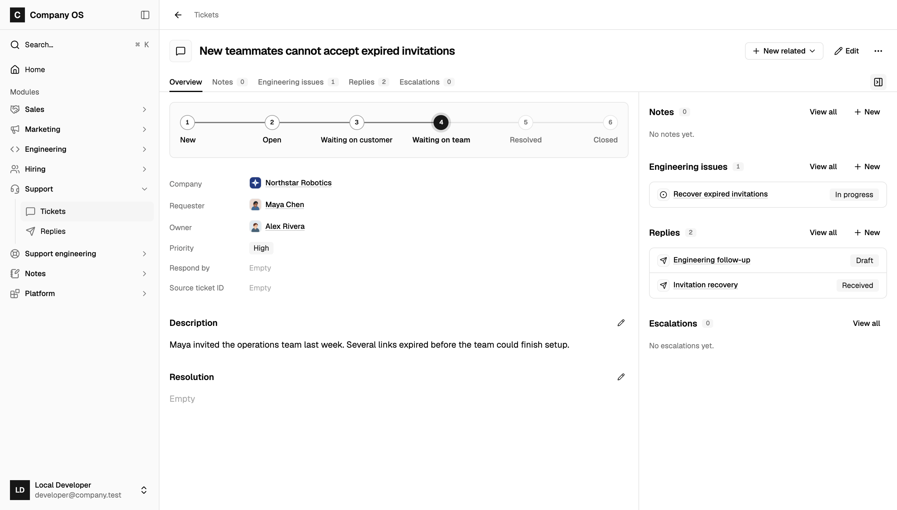
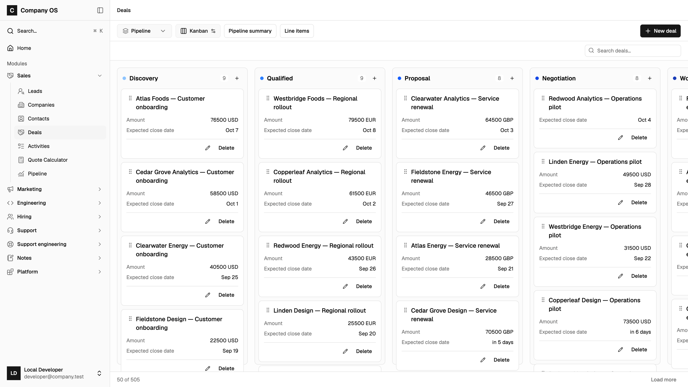
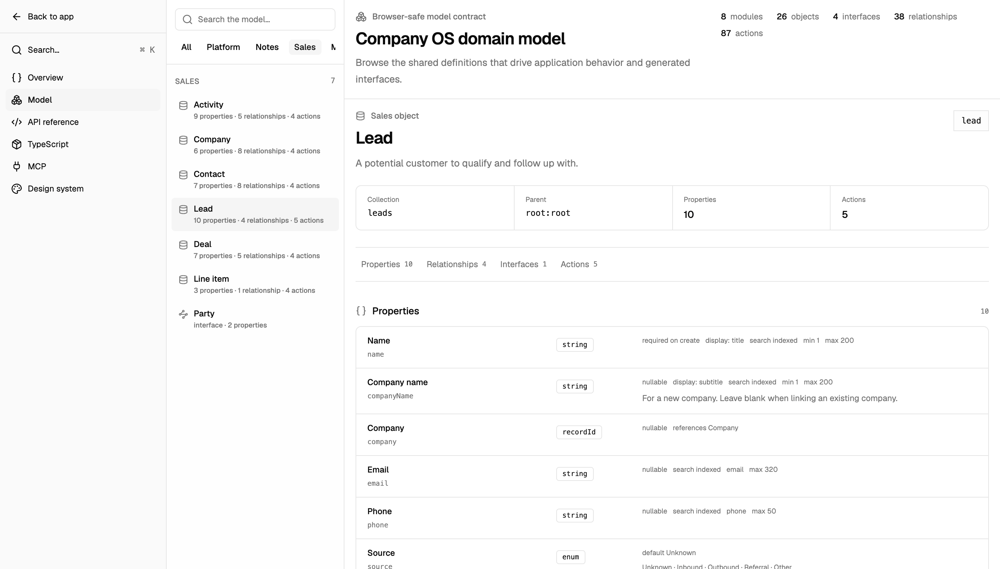

<div align="center">
  <h1>Company OS</h1>
  <p><strong>Build the software your company runs on.</strong></p>
  <p>
    An open-source business application for people and agents.<br />
    Start with sales, support, engineering, or hiring. Make it yours with TypeScript.
  </p>
  <p>Early preview · React · Effect v4 · PostgreSQL · Apache 2.0</p>
  <p>
    <a href="#quick-start">Run locally</a> ·
    <a href="#one-model-every-interface">How it works</a> ·
    <a href="#make-it-yours">Make it yours</a> ·
    <a href="docs/deployment.md">Deploy</a>
  </p>
</div>



<p align="center"><sub>A customer problem, the people responsible, and the engineering work to resolve it. Actual app screenshot with fictional demo data.</sub></p>

Company OS is one application you clone and own. Change a field, add a business rule, or build a
new workflow by editing the source—with or without a coding agent. You own the code and database.
It runs locally without a Continual account.

- **Start with a working app.** Search, linked records, tables, boards, forms, Markdown notes,
  and record pages are already there.
- **Define business behavior once.** The UI, typed client, HTTP API, and MCP tools use the same
  model and server operations.
- **Change the whole application.** Modules are editable TypeScript. Custom rules are Effect
  functions; custom screens are React. The runtime and UI components are in this repository too.

## Quick start

You need Node.js 24.14+ (or 25.4+), pnpm 11, and PostgreSQL 18+. PostgreSQL must be running,
and your local role must be able to create a database.

```sh
git clone https://github.com/continual-ai/company-os.git
cd company-os
pnpm install --frozen-lockfile
pnpm db:reset
pnpm dev
```

Open **[localhost:3002](http://localhost:3002)**. Development signs you in as a local administrator;
no OAuth setup or hosted service is needed.

To explore with fictional records like those in the screenshots, run this in another terminal:

```sh
pnpm db:seed --scenario demo
```

`pnpm db:reset` creates the database from the model and initializes system records. **It deletes
existing local data.** The default database is `postgresql://localhost:5432/company_os`.
Put overrides in an ignored `.env.local`; see [`.env.example`](apps/company-os/.env.example).
Injected environment values take precedence. Demo seeding preserves your edits when rerun.

## Start with the work you already do

The included modules share records across teams. A support ticket can link to the same customer
used by sales and the engineering issue that resolves it.

| Module           | Starting point                                                       |
| ---------------- | -------------------------------------------------------------------- |
| Sales            | Leads, companies, contacts, deals, and activities                    |
| Marketing        | Campaigns, content, enrollments, and outreach                        |
| Engineering      | Issues, projects, repositories, and pull requests                    |
| Hiring           | Jobs, candidates, and applications                                   |
| Support          | Tickets and replies, with engineering links and escalations          |
| Notes & Platform | Shared notes, users, service accounts, assets, and module management |



<p align="center"><sub>The sales pipeline, using the same records available in tables and through the API. Fictional demo data.</sub></p>

Enable the modules you need in **Platform → Modules**. Add your own alongside them.
Disabling a module hides its operations and screens while retaining its data.

## One model, every interface

A module defines its records, relationships, and operations in TypeScript. For example, the
[Note object](apps/company-os/src/modules/notes/model/index.ts) defines its content as Markdown:

```ts
export const Note = defineObject({
  id: "note",
  collection: "notes",
  name: "Note",
  pluralName: "Notes",
  description: "Notes on conversations, decisions, or next steps.",
  properties: {
    content: schema.markdown({
      label: "Content",
      minLength: 1,
      maxLength: 10_000,
    }),
  },
  search: { fields: ["content"] },
  display: { icon: "note", title: "content" },
})
```

Once composed into the app, that model drives PostgreSQL storage, validated CRUD, search,
record pages, forms, a typed client, OpenAPI, and MCP tools. The Markdown field gets the shared
editor, prose renderer, and compact table preview.

Business rules run on the server for every caller. An agent calling a model operation through
MCP uses the same validation, transactions, and attribution as the UI. Your agent runtime owns
scheduling and execution; Company OS provides the business operations it can call.

<details>
<summary><strong>See the live model explorer</strong></summary>



Open `/developer` to inspect the active model, API reference, TypeScript client, and MCP connection.
The generated OpenAPI contract is available at `/api/openapi`; the MCP endpoint is `/api/mcp`.

</details>

## Make it yours

Tell your coding agent the outcome, who uses it, and the scope. This repository includes two skills:

| Skill                                          | Use it for                                              |
| ---------------------------------------------- | ------------------------------------------------------- |
| [onboard](.agents/skills/onboard/SKILL.md)     | Company setup and the first working process             |
| [customize](.agents/skills/customize/SKILL.md) | New features, UI changes, reviews, and upstream updates |

> Use $onboard to set this up for our company. Start with customer onboarding: customers,
> milestones, owners, blockers, and launch dates.

> Use $customize to add hiring: jobs, candidate applications, and employee or agent reviews.
> Backend only for now; prepare public application submission and keep reviews private.

Business modules live in [`apps/company-os/src/modules`](apps/company-os/src/modules).
[`app.model.ts`](apps/company-os/src/app.model.ts) composes them.
Change the name, branding, and entry experience in
[`src/app/customization`](apps/company-os/src/app/customization).

## Documentation

- [Development](docs/development.md) — commands, migrations, application structure, and UI conventions.
- [Deployment](docs/deployment.md) — hosting, identity, database upgrades, and production verification.
- [Configuration](apps/company-os/.env.example) — local and production environment values.
- [Repository conventions](AGENTS.md) — boundaries and guidance for people and coding agents.

**Early preview:** expect the source and model to evolve. Review business rules, project access,
and migrations before putting company data into production.

Maintained by [Continual](https://continual.ai), which offers optional hosting.
Self-hosting is supported. Licensed under [Apache 2.0](LICENSE).
